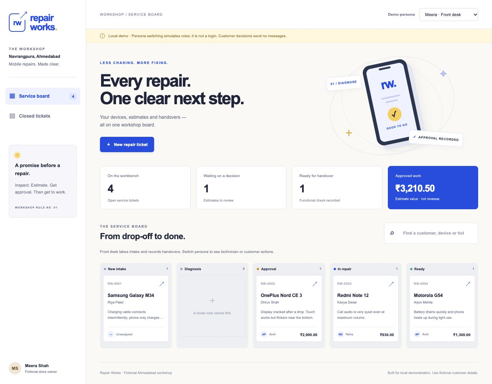
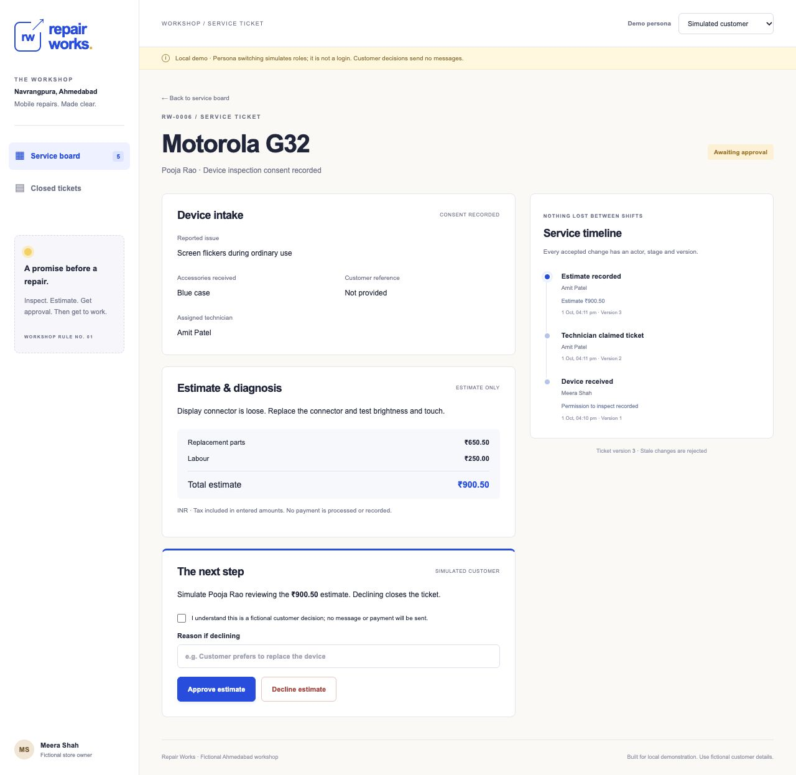
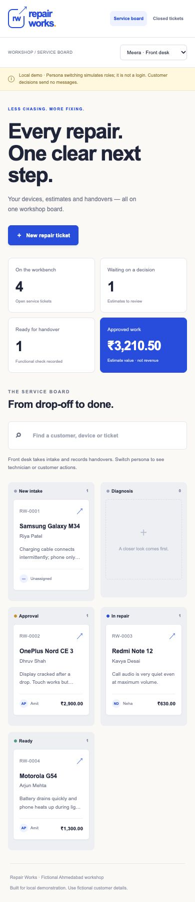
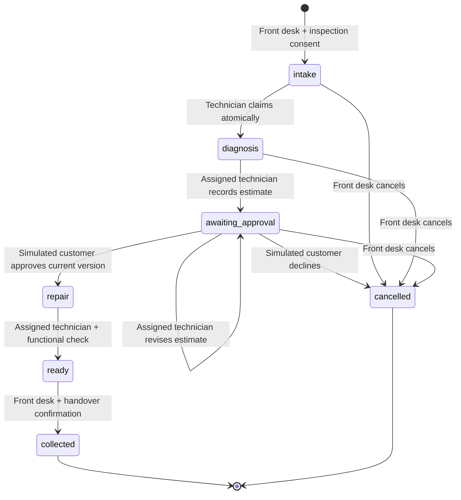

# Repair Works — Mobile Repair Workshop Desk

A small Ahmedabad mobile repair shop receives a cracked screen, quotes the customer, and hands the device back after repair. When that work moves between shifts, the next action and the customer's approval should remain clear.

**Repair Works** is a standalone Flask application that tracks that workflow on a cobalt service board. A technician must claim a ticket before diagnosis, a customer decision must approve its estimate before repair, and a functional check must precede collection. Two technicians claiming the same ticket cannot both win.

The shop, customers, devices and service notes are fictional. The application runs locally and uses no paid APIs, SMS, email or payment service. Persona switching is explicitly a **role simulation, not authentication**.



## What you can demonstrate

- Device intake with inspection consent and an accessories record.
- Atomic technician assignment: one owner, with optimistic revision checks.
- Exact INR estimates stored as integer paise, not floating-point balances.
- Estimate revision before approval; an old customer view cannot approve a new quote.
- Clearly labelled simulated customer approval or decline.
- Repair completion with a functional-check confirmation.
- Front desk handover and closed tickets that retain their history.
- An event timeline with actor, timestamp, version and accepted change values.
- A responsive desktop and mobile interface, literal text search, and a closed-ticket archive.

## Start locally

Use **Python 3.10–3.12**. The local verification environment used Python 3.12.14. Python 3.10 and 3.12 are configured in the prepared CI workflow; remote CI has not been run for this local repository.

From this project's folder:

```bash
python3 -m venv .venv
source .venv/bin/activate
python -m pip install -r requirements.txt
python app.py
```

Open **http://127.0.0.1:8107/**. The server binds to loopback and debug mode is off. The first start seeds five fictional tickets when the database is empty. No account or API key is needed.

Windows PowerShell:

```powershell
py -3.12 -m venv .venv
.venv\Scripts\Activate.ps1
python -m pip install -r requirements.txt
python app.py
```

If PowerShell restricts script activation, call `.venv\Scripts\python.exe` directly for the install and run commands.

Use a different port or a new, separate data folder:

```bash
python app.py --port 8207 --data-dir ./instance-practice
python app.py --no-demo --data-dir ./instance-empty
```

`--no-demo` skips seeding; it does not delete existing tickets. A separate fresh directory starts with an empty board. If you create an alternate data directory inside the repository, add it to your local `.git/info/exclude` before committing; the default `instance/` directory is already ignored. Keep private local data out of source control.

Stop the server with `Ctrl+C`. Start it again to resume the same tickets. The default SQLite database and the locally generated session-signing key remain in `instance/`.

## Five-minute walkthrough

1. On the board, open **Riya Patel / Samsung Galaxy M34 / RW-0001**. It is an unassigned intake. The default persona is **Meera · Front desk**.
2. Click **Switch to Amit Patel**, then **Claim ticket as Amit Patel**. The ticket moves to diagnosis and records its assigned technician.
3. Enter a diagnosis, for example “Charging port assembly damaged; replace and test charging.” Enter parts `480.25` and labour `210.50`. Click **Save estimate for approval**. The total is ₹690.75.
4. Switch to **Simulated customer**. Read the estimate, check the simulation acknowledgement, and click **Approve estimate**. The ticket moves to repair. No message is sent.
5. Switch back to **Amit · Technician**. Enter a completion note, confirm the functional check, and mark the device ready.
6. Switch to **Meera · Front desk**. Confirm the person receiving the device and record collection. View the retained timeline in **Closed tickets**.

Other seed tickets demonstrate an estimate awaiting approval (Dhruv Shah), a repair in progress (Kavya Desai), a device ready for collection (Arjun Mehta), and a completed handover (Ishita Joshi). Every seeded state is created through the same workflow functions as normal tickets.

To try a conflicting update, open the same intake in two browser sessions with different technicians, then claim it in both. Only the first accepted claim succeeds. The other session must reload the current ticket. Separate tabs in one browser share the current demo persona; use an incognito or separate browser session when testing independent people.



<details>
<summary>Mobile service board</summary>



</details>

## Workflow rules



Inspection consent and repair approval are separate. An estimate can change only before approval. A collected or cancelled ticket is closed. The app does not model cancellation during an active repair, warranty rework, refunds, deposits or parts inventory.

The server checks permissions and workflow state for every change; disabling a UI button is not the permission boundary. However, anyone using this local demo can intentionally select another persona. Production authentication, customer-specific access, identity verification and deployment hardening would be separate work.

## Tests and verification

```bash
source .venv/bin/activate
python -m pip install -r requirements-dev.txt
python -m pytest --cov=workshop --cov-report=term-missing --cov-fail-under=90
python -m pip check
```

For the exact tested environment, install `requirements-tested.txt` instead. It includes the development tools as well as Flask.

The current local suite has **67 passing tests** and **98% Python statement coverage**. It checks complete and declined workflows, invalid skips, role permissions, revised quotes, closed records, confirmation flags, exact monetary limits, safe multiline service notes, CSRF and origin enforcement, cookie isolation, persistent sessions, repeated intake requests, atomic audit writes, and simultaneous claims on separate SQLite connections. One test injects an audit-write failure and verifies the job change rolls back too. The database approval constraint is also tested directly, including a `NULL` decision.

Read [validation notes](docs/VALIDATION.md) for scope and practical limits. The tests use temporary databases and fictional data, and do not call an external service. The test suite exercises the Flask API and domain layer; screenshots and browser checks cover the actual interface separately. A prepared workflow is included in `.github/workflows/tests.yml`; its presence does not mean remote CI has run.

## API and boundaries

All write endpoints accept a JSON object and require the browser session's `X-CSRF-Token`. Get the token and session cookie from `GET /api/bootstrap`. A provided `Origin` must match the local server origin. A persona is stored in the signed session cookie, rather than taken from an action's JSON body.

| Method | Endpoint | Purpose |
|---|---|---|
| GET | `/api/health` | Check server and database readiness |
| GET | `/api/bootstrap` | Obtain CSRF token, personas and fictional shop details |
| POST | `/api/persona` | Explicitly switch simulated role |
| GET | `/api/jobs?status=active&q=Samsung` | Filter and search tickets |
| POST | `/api/jobs` | Create intake with consent and request ID |
| GET | `/api/jobs/<id>` | Get ticket and service events |
| POST | `/api/jobs/<id>/actions/<action>` | Apply a versioned workflow action |

Actions are `claim`, `estimate`, `approve`, `decline`, `ready`, `collect`, and `cancel`. Every action requires the last read positive integer `revision`. An estimate additionally needs `diagnosis`, `parts`, and `labour`; amounts use plain INR decimal notation. Customer decisions need `confirmed: true`, and decline also needs a reason. Ready needs `completion_note` and `tested: true`. Collection needs `collected_by` and `confirmed: true`.

An intake uses an 8–80 character alphanumeric/dash/underscore `request_id`. Identical retries return the same ticket; reuse of that ID with different details returns a conflict. Workflow-action retries with an old revision return `409` and require a fresh read. They do not duplicate events.

Response meanings: `400` malformed JSON or untrusted host, `403` wrong role or CSRF/origin failure, `404` absent ticket, `409` stale version or invalid workflow stage, `413` body over 32 KiB, `415` missing JSON content type, and `422` invalid field values. Validation failures do not update the ticket or append an event.

## How it is built

```text
repair-shop-desk/
├── app.py                     # Loopback launcher and CLI flags
├── workshop/
│   ├── __init__.py             # Flask factory, session/CSRF, JSON routes
│   ├── domain.py               # State machine, role and INR validation
│   ├── db.py                   # SQLite transactions, versions, event history
│   ├── demo.py                 # Original fictional seed tickets
│   ├── templates/index.html    # Accessible workspace shell
│   └── static/                 # Native CSS, JavaScript, SVG mark
├── tests/                     # Workflow, validation, concurrency and persistence
├── docs/                      # Validation and actual working screenshots
├── .github/workflows/         # Checks prepared for a future push
├── requirements*.txt
└── instance/                  # Ignored local database and signing key
```

No frontend build, Node runtime, CDN, external font or JavaScript framework is required. Flask serves the interface and JSON API, SQLite stores one fictional store's tickets, and vanilla JavaScript updates the board and action forms. Each accepted action commits its job projection and event together inside `BEGIN IMMEDIATE`. Per-ticket revisions prevent an old view from replacing a newer change. SQL parameters handle incoming values; dynamic update column names come only from the server's fixed workflow change sets.

Browser sessions use the distinct `repair_session` cookie so this project can run beside other localhost demos on different ports. API responses are not cached, fields render as text or escaped HTML, and a same-origin content security policy blocks inline scripts and framing. These are local demo protections, not a claim that the app is ready to handle real customer data on the public internet.

## Interview discussions

- Why is disabling “Claim” on the frontend insufficient to prevent a race?
- Why do assignment and its audit event share one database transaction?
- What happens when a customer approves while a technician is revising the quote?
- What is the difference between an idempotent intake retry and a stale workflow action?
- Which rules belong in the state machine, which can SQLite enforce, and which require genuine authentication?
- How would you add authenticated customer links, a parts reservation workflow, or warranty rework without reopening a collected record?

The repository's commits represent actual local development modules. No dates were fabricated and no remote operations were performed. Screenshots are captures of the running application. Private learning and design notes are kept outside this repository so they will not be included in a later push.

## License

MIT for the application and original fictional demo data. Dependency licenses remain their respective authors' licenses.
